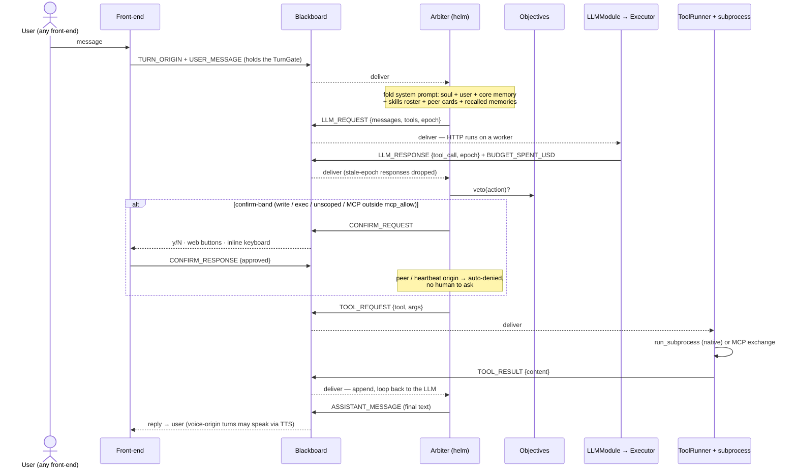

# hades — Architecture

`hades` is an AI-agent harness that ports the **MOOS-IvP** robotics architecture to a software, LLM-driven agent: a central publish/subscribe **Blackboard** (the "MOOSDB"), pluggable **Modules** (the "apps"), and a gating **Arbiter** (the "helm"). One agent = one community: a Blackboard, an Arbiter, and the module set the manifest rosters. More agents = more communities, bridged pShare-style.

Everything below is built and live-validated. The manifest key reference lives in [`manifest-reference.md`](manifest-reference.md).

> Diagrams are [Mermaid](https://mermaid.js.org) — they render automatically on GitHub, in VS Code (Markdown preview), and in Obsidian.

---

## 1. Component & data-flow

Modules never call each other. They **only** post and subscribe on the Blackboard; the single-threaded `pump()` loop drains posted events to subscribers. Blocking work (the LLM HTTP call) is offloaded to an **Executor** worker that posts its result back — dispatch stays deterministic on one thread. Tools run as **isolated subprocesses**. Four user front-ends and the peer bridge all drive whole turns serialized through one **TurnGate**. Secrets (API key, bot token, bridge secret) live only in env vars and outbound headers — never on the blackboard, never unredacted in the log.

```mermaid
flowchart TB
    subgraph boot["boot (once)"]
      MAN[/"manifest (.hades)<br/>Module= roster · Tool= · Objective= · blocks"/]
      WIRE["Launcher · agent_wiring<br/>(pAntler analog)"]
      MAN --> WIRE
    end

    subgraph fe["front-ends — whole turns serialized by one TurnGate"]
      CHAT["ChatModule<br/>stdin REPL (readline)"]
      SRV["HttpServerModule<br/>--serve: web UI + JSON API"]
      TG["TelegramModule<br/>long-poll bot, allowlisted"]
      SX["SimplexModule<br/>local simplex-chat daemon (WS)"]
    end

    subgraph proc["hades process — single-threaded dispatch"]
      BB{{"<b>Blackboard</b><br/>latest-value map + FIFO pump<br/>thread-safe post() · run_until()"}}
      EV[("<b>Eventlog</b><br/>session.log — append-only, secrets redacted")]
      BB -- "every post()" --> EV

      ARB["<b>Arbiter</b> — the helm<br/>per-turn: prompt fold → propose → gate → act"]
      LLM["<b>LLMModule</b>"]
      EXEC["Executor worker pool<br/>(offloads the blocking HTTP call)"]
      TR["<b>ToolRunner</b>"]
      OBJ["<b>Objectives</b> (behaviors)<br/>capability_policy · avoid_destructive<br/>stay_on_budget · peer_loop_guard · self_schedule_guard"]

      MEM["MemoryModule<br/>keyword recall"]
      EMB["EmbeddingMemoryModule<br/>semantic recall (opt-in)"]
      SK["SkillsModule<br/>skills roster announce"]
      HB["HeartbeatModule<br/>cron + when= self-turns"]

      ARB <--> BB
      LLM <--> BB
      TR  <--> BB
      MEM <--> BB
      EMB <--> BB
      SK  <--> BB
      HB  <--> BB
      ARB -. "veto / confirm" .-> OBJ
      LLM -. "offload" .-> EXEC -. "post result" .-> BB
    end

    CHAT & SRV & TG & SX <--> BB
    WIRE --> BB
    WIRE -. "builds + attaches the rostered set" .-> proc

    PROV["Provider (openai_compat)<br/>endpoint · model · key-from-env"]
    EP(("LLM endpoint<br/>PPQ · OpenRouter · local"))
    EXEC --> PROV --> EP

    SUB["run_subprocess<br/>fork/exec · timeout(SIGKILL) · rlimit"]
    NT["18 native tool binaries<br/>hades-fs-read … hades-cancel-task"]
    MCPS["MCP servers<br/>stdio spawn or Streamable HTTP<br/>tools discovered as block__tool"]
    TR --> SUB --> NT
    TR --> MCPS

    BRG["BridgeModule<br/>/ask · /share · /card"]
    PEER(("peer hades agents"))
    BRG <--> BB
    BRG <--> PEER

    SCOPE["hades-scope CLI<br/>filter / replay"]
    EV --> SCOPE

    U((user)) <--> fe
```

---

## 2. The per-turn loop (sequence)

One turn, from any front-end. The LLM **proposes**; the Arbiter **gates** the proposal through the objectives before anything executes; a confirm-band action is held for human approval; tool results loop back to the LLM until it emits a final answer.

A hard veto (denied path read, private-net fetch, peer loop) short-circuits to `ASSISTANT_MESSAGE "[blocked: …]"`. A declined confirm yields `"[declined by user]"`. A turn exceeding the max tool-step count stops with `"[stopped: reached max tool steps]"`. An idle-stalled turn is abandoned by the front-end (`TURN_ABANDONED` bumps the epoch so a late response can never contaminate the next turn).

**Threading model.** Subscriber handlers run ONLY on the pump thread (deterministic dispatch); `post()` is thread-safe so workers and module threads can call it. Front-ends drive a turn with `run_until(pred, idle_timeout)` — the deadline resets on progress, so a long-but-alive turn never false-times-out. Each thread-owning module (telegram poll, simplex event loop, bridge listener, heartbeat timer) starts its thread after wiring and stop+joins it in its destructor; teardown order is load-bearing and documented in the headers.

---

## 3. Autonomy — self-triggered turns

The agent is not only event-driven; it runs its own turns:

- **Static heartbeats** — `Heartbeat = <name>` manifest blocks with a 5-field **cron** schedule (machine-local TZ, minute resolution) *or* a reactive **`when =`** condition over any blackboard key (`changes / is / not / above / below`; edge-triggered, cooldown absorbs flaps, ≤ ~30 s latency).
- **Self-scheduling** — three native tools (`schedule_task`, `list_tasks`, `cancel_task`) let the agent plant its own cron or one-shot tasks at runtime, persisted in `.hades/cron.jsonl` and picked up by the heartbeat scan within ~30 s. A scheduled task is a **prompt**, never a raw command — it fires as a normal gated turn.
- A tick is a **normal turn** with `TURN_ORIGIN = heartbeat:<name>`: full system prompt, all objectives, any tool. Confirm-band actions **auto-deny** (no human present) — unattended power comes only from explicit allow scopes. A tick that collides with a live conversation is **skipped**, never queued.
- `notify = true` posts the trimmed reply to `NOTIFY_USER`, delivered by the rostered chat front-ends (Telegram, SimpleX); the `SILENT` reply convention suppresses "nothing to report" noise.
- Guardrails: `SelfScheduleGuard` (a tick can't breed more ticks unless opted in; a **peer can never** plant standing work), task caps, and the budget objective.

## 4. Multi-agent — the Bridge

`Module = bridge` gives an agent a small authenticated HTTP surface; peers are named `Peer = <name>` blocks. pShare analog, three channels:

- **`POST /ask`** — a peer's question drives a **normal gated turn** on the receiver (`TURN_ORIGIN = peer:<name>`): the receiver's own objectives apply, confirm-band actions auto-deny, and `PeerLoopGuard` hard-vetoes onward delegation (max_hops = 1 — no loops). Outbound, the `ask_agent` tool POSTs to a peer and returns the reply as a tool result.
- **`POST /share`** — typed pushes: `card` (capability advertisement), `fact` (trust-labeled claim), `raw`. Every arrival is renamed to `PEER.<from>.…` — a peer can never write a local bus key.
- **`GET /card`** — an A2A-shaped agent card (name, skills, tools, capability **summary** — categories only, never literal allowlists), re-pulled periodically and folded into each turn's system prompt so the LLM delegates by advertised capability.

All three are gated by a shared secret (env var) + peer allowlist. Peer replies and shares are **reports, not truth** — the prompt frames them for re-verification.

## 5. Memory & skills

Three memory layers, all agent-writable, plus loadable instruction packs:

| layer | store | write path | read path |
|---|---|---|---|
| **Core** | `memory/facts.md` (char-capped, ~600 tokens) | `core_memory` add/replace/remove; over-cap writes refused with the full list → forces consolidation | re-read and folded into the system prompt **every turn** |
| **Archival** | `.hades/memory.jsonl` (append-only) | `save_memory` | keyword-ranked per turn → injected as a labeled memory block |
| **Semantic** (opt-in) | `.hades/embeddings/*.vec.jsonl` | background indexer (archival + past sessions) | cosine-ranked per turn → "facts" + "earlier sessions" sub-blocks |
| **Sessions** | `.hades/sessions/<id>.jsonl` | appended per message | `--resume [id]` reloads; requests send a tool-pairing-safe recent window |

**Skills** are `skills/<name>/SKILL.md` packs (frontmatter description + markdown body). `SkillsModule` announces the roster into the system prompt; `use_skill` loads a pack mid-turn; `save_skill` writes or patches one (atomic, name-gated, frontmatter-validated) — the agent authors its own library at runtime.

## 6. Tools & the capability gate

Eighteen **native tools** ship as standalone binaries, spawned per call under `run_subprocess` (fork/exec, wall-clock SIGKILL timeout, rlimit): file ops (`fs_read write_file edit_file list_dir grep glob`), exec (`shell run_command git_read`), net (`http_fetch`), memory (`save_memory core_memory`), skills (`use_skill save_skill`), delegation (`ask_agent`), scheduling (`schedule_task list_tasks cancel_task`).

**MCP servers** roster as `Tool = <block> { mcp = <cmd> }` (stdio) or `{ mcp_url = <url> }` (Streamable HTTP, Bearer auth from env). Their tools are **discovered at boot** (`tools/list`) and announced to the LLM as `<block>__<tool>` with their own schemas; calls route back through the server's real tool name. Discovery is fail-soft — a dead server degrades to the legacy path, never blocks boot.

Every proposed action passes the **capability gate** before execution. A built-in `capability_of(tool)` table (the authority — a tool cannot grant itself permission) maps tools to capabilities; the `capability_policy` objective applies manifest scopes:

- **allow** — in-scope reads (`fs_read_allow`), public fetches, scoped writes (`fs_write_allow`), scoped exec (`exec_allow`), the agent's own memory/skills, MCP tools in `mcp_allow`
- **confirm** — everything out of scope: writes, shell, unknown tools, undiscovered MCP tools (auto-denied on peer/heartbeat turns)
- **hard veto** — `fs_deny` paths, private/loopback fetch targets (SSRF-hardened), peer-origin delegation, staleness violations

The **staleness guard** adds lost-update protection: `edit_file`/`write_file` carry an Arbiter-injected version token from the last read; a file changed on disk since is refused with a self-healing "re-read and retry" error.

---

## 7. Blackboard message keys (the "MOOSDB variables")

| group | key | payload / notes |
|---|---|---|
| turn | `USER_MESSAGE` | string — from any front-end or a heartbeat prompt |
| | `TURN_ORIGIN` | `human` · `peer:<name>` · `heartbeat:<name>` — read by the guards |
| | `LLM_REQUEST` / `LLM_RESPONSE` | `{messages, tools, model, epoch}` / `{text, tool_call?, tokens, epoch}` |
| | `TOOL_REQUEST` / `TOOL_RESULT` | `{id, tool, args}` / `{id, ok, content}` |
| | `CONFIRM_REQUEST` / `CONFIRM_RESPONSE` | `{id, prompt, action}` / `{id, approved}` |
| | `ASSISTANT_MESSAGE` | string — the final reply |
| | `TURN_ABANDONED` / `NEW_SESSION` | idle-timeout epoch bump / `/new` session rotation |
| memory | `RETRIEVED_MEMORY` | keyword-ranked archival hits (per turn) |
| | `RETRIEVED_MEMORY_SEMANTIC` / `RETRIEVED_SESSION_SEMANTIC` | embedding hits, split facts vs past-session excerpts |
| skills | `SKILLS_ANNOUNCE` | preformatted roster, folded into the system prompt |
| autonomy | `NOTIFY_USER` | `{text, from}` — delivered by Telegram/SimpleX |
| | `HEARTBEAT_SKIPPED` / `HEARTBEAT_ERROR` | busy-skip / entry failure |
| peers | `PEER.<from>.card` / `PEER.<from>.fact.<key>` / `PEER.<from>.<key>` | typed shares, rename-on-arrival |
| budget | `BUDGET_SPENT_USD` | cumulative — read by `stay_on_budget` |
| trace | `NEXT_ACTION` / `MODE` | Arbiter decision record / mode stub |

---

## 8. MOOS-IvP → hades mapping

| MOOS-IvP | hades | file(s) |
|---|---|---|
| MOOSDB (latest-value pub/sub) | **Blackboard** (+ **Eventlog** for history) | `src/core/blackboard.cpp`, `eventlog.cpp` |
| MOOS app (lifecycle, pub/sub) | **Module** | `src/apps/<name>/` — one dir per app |
| `pAntler` (launcher) | **Launcher** / `Module =` roster | `src/core/launcher.cpp`, `app/agent_wiring.cpp` |
| `.moos` mission file | **Manifest** (plain-text blocks) | `src/core/config.cpp` |
| `pHelmIvP` (helm) | **Arbiter** | `src/apps/arbiter/` |
| behavior (IvPBehavior) | **Objective** — competing goals of ONE agent | `src/behaviors/` |
| priority `pwt` | hard-veto → confirm → allow bands | `src/behaviors/capability_policy.cpp` |
| timer-driven app (`Iterate()` rate) | **HeartbeatModule** (cron + `when=`) | `src/apps/heartbeat/` |
| `pShare` / `pMOOSBridge` | **BridgeModule** (`/ask` `/share` `/card`) | `src/apps/bridge/` |
| a vehicle / community | **one agent** = Blackboard + Arbiter + modules | — |
| `.alog` + `alogview` | **Eventlog** + **hades-scope** | `src/apps/scope/` |

The load-bearing **break** from MOOS: agent actions are discrete, heterogeneous, side-effecting tool calls — not a continuous blendable domain — so there is **no ZAIC/branch-and-bound**; arbitration is a gate (hard veto + confirm + allow) over enumerated actions, and the latest-value store is paired with the append-only Eventlog because LLM agents are history-dependent.

---

## 9. Invariants (what keeps it correct)

- **Decoupling** — a module knows nothing about other modules; all coordination is blackboard posts. Dispatch is single-threaded (pump thread only); `post()` is thread-safe for workers and module threads.
- **One turn at a time** — every surface (REPL, web, Telegram, SimpleX, peer `/ask`) serializes whole turns through one TurnGate; heartbeat ticks `try_lock` and skip, never queue.
- **No tool runs un-gated** — `TOOL_REQUEST` is posted **only** by the Arbiter, after the objective veto/confirm loop. Unattended origins (peer, heartbeat) get exactly the unconfirmed power set.
- **Isolation** — every native tool and stdio MCP server runs as a child process under `run_subprocess` with a wall-clock timeout (SIGKILL); a hung/crashing tool can't take down the agent.
- **Secret safety** — API key, bot token, and bridge secret come from named env vars, flow only into outbound headers, and are redacted in the Eventlog. Never on the blackboard, stdout, or disk.
- **Stale-response immunity** — turn epochs stamp every `LLM_REQUEST`; abandonment and `/new` bump the epoch, so a late worker post can never contaminate a later turn.
- **Fail loud at boot, fail soft at runtime** — manifest errors (packed lines, bad cron, missing required keys) throw `MalConfig` before side effects; runtime degradations (embedder down, MCP server dead, TTS failure) log and degrade, never crash a turn.
- **Lifetime** — the `Agent` holder owns the modules; thread-owning members are declared so destruction joins each thread while everything it touches is still alive; the Blackboard outlives the Agent.

---

## 10. Deliverables

| binary | role |
|---|---|
| `hades` | the agent — `hades <manifest> [--serve [port]] [--resume [id]]` |
| `hades-fs-read` · `hades-write-file` · `hades-edit-file` · `hades-list-dir` · `hades-grep` · `hades-glob` | file tools |
| `hades-shell` · `hades-run-command` · `hades-git-read` | exec tools |
| `hades-http-fetch` | net tool (redirects off, SSRF-gated) |
| `hades-save-memory` · `hades-core-memory` | memory tools |
| `hades-use-skill` · `hades-save-skill` | skills tools |
| `hades-ask-agent` | peer delegation |
| `hades-schedule-task` · `hades-list-tasks` · `hades-cancel-task` | self-scheduling |
| `hades-scope` | replay/filter the Eventlog: `hades-scope session.log [KEY_PREFIX]` |
| `hades_tests` | the GoogleTest suite (ASan+UBSan and TSan lanes) |

Builds inside the Nix dev shell (`nix develop`); `nix build .#hades-aarch64-static` produces a fully static musl aarch64 deploy dir (binaries + web/ + prompts/ + a Pi manifest) that runs on a bare Raspberry Pi with zero dependencies.

## 11. Consciously deferred

v2 **scoring** arbiter (objectives score a candidate set, weighted-sum argmax) · SSE/WebSocket token streaming · tool-call offload (tools still run inline on the pump thread) · capability v2 (per-origin scopes, realpath/symlink resolution, positive net allowlist, DNS-rebind enforcement) · multi-session per agent · group chat (user + N agents) · sqlite/ANN vector store behind the `VectorCache` seam · memory auto-extract · settings UI · warm persistent MCP children.
