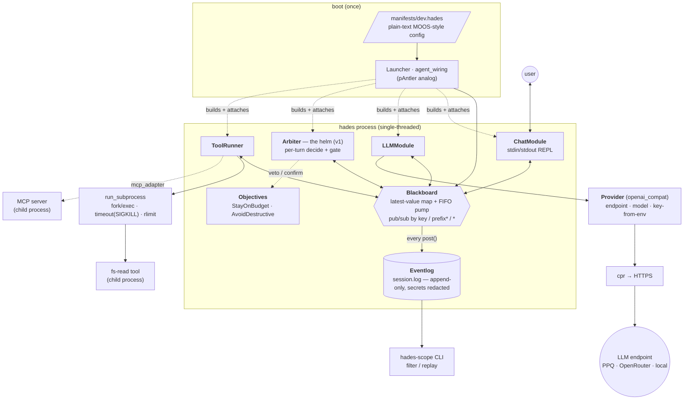
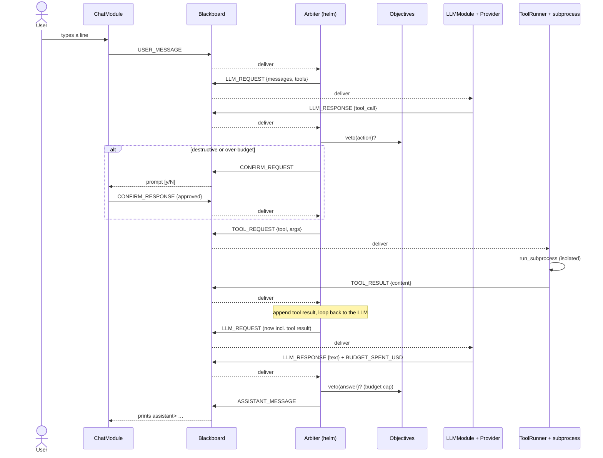

# hades — Architecture

`hades` is an AI-agent harness that ports the **MOOS-IvP** robotics architecture to a software, LLM-driven agent: a central publish/subscribe **Blackboard** (the "session"), pluggable **Modules** (the "apps"), and a behavior-arbiter **Arbiter** (the "helm"). Everything below is the MVP slice that is built and live-validated.

> Diagrams are [Mermaid](https://mermaid.js.org) — they render automatically on GitHub, in VS Code (Markdown preview), and in Obsidian.

---

## 1. Component & data-flow

Modules never call each other. They **only** post and subscribe on the Blackboard; the single-threaded `pump()` loop drains posted events to subscribers. Tools run as **isolated subprocesses**. The API key lives only in an env var and in the outbound HTTPS header — never on the blackboard, never in the log.

---

## 2. The per-turn loop (sequence)

One user turn. The LLM **proposes**; the Arbiter **gates** the proposal through the objectives before anything executes; a destructive/over-budget action is held for human confirmation; tool results loop back to the LLM until it emits a final answer.

A hard veto (no confirm) short-circuits to `ASSISTANT_MESSAGE "[blocked: …]"`. A declined confirm yields `"[declined by user]"`. A turn that exceeds the max tool-step count stops with `"[stopped: reached max tool steps]"`.

---

## 3. Blackboard message keys (the "MOOSDB variables")

| key | payload | producer → consumer |
|---|---|---|
| `USER_MESSAGE` | string | Chat → Arbiter |
| `LLM_REQUEST` | `{messages, tools, model}` | Arbiter → LLM |
| `LLM_RESPONSE` | `{text, tool_call?, prompt_tokens, completion_tokens, stop_reason}` | LLM → Arbiter |
| `TOOL_REQUEST` | `{id, tool, args}` | Arbiter → ToolRunner |
| `TOOL_RESULT` | `{id, ok, content}` | ToolRunner → Arbiter |
| `CONFIRM_REQUEST` | `{id, prompt, action}` | Arbiter → Chat |
| `CONFIRM_RESPONSE` | `{id, approved}` | Chat → Arbiter |
| `ASSISTANT_MESSAGE` | string | Arbiter → Chat |
| `BUDGET_SPENT_USD` | number (cumulative) | LLM → StayOnBudget |
| `NEXT_ACTION` | `{kind, …}` | Arbiter (decision record) |
| `MODE` | string (stub `"EXECUTING"`) | Arbiter |

---

## 4. MOOS-IvP → hades mapping

| MOOS-IvP | hades | file(s) |
|---|---|---|
| MOOSDB (latest-value pub/sub) | **Blackboard** (+ **Eventlog** for history) | `blackboard.*`, `eventlog.*` |
| MOOS app (lifecycle, pub/sub) | **Module** | `module.h`, `module/*` |
| `pAntler` (launcher) | **Launcher** / **agent_wiring** | `launcher.*`, `app/agent_wiring.*` |
| `.moos` mission file | **Manifest** (plain text) | `config.h`, `config/manifest.cpp` |
| `pHelmIvP` (helm) | **Arbiter** | `arbiter.*` |
| behavior (IvPBehavior) | **Objective** | `objective.h`, `objective/*` |
| IvP function (utility surface) | scored/gated **Action** | `objective.h` |
| priority `pwt` | objective **weight** (v2) + a **hard-veto** stage | `objective/*`, `arbiter.cpp` |
| `.alog` + `alogview` | **Eventlog** + **hades-scope** | `eventlog.*`, `obs/*` |
| scope/poke (`uXMS`/`uPokeDB`) | **scope** CLI / blackboard `post` | `obs/scope*` |

The load-bearing **break** from MOOS: agent actions are discrete, heterogeneous, side-effecting tool calls — not a continuous blendable domain — so there is **no ZAIC/branch-and-bound**; arbitration is a gate (hard veto + human confirm) over enumerated actions, and the latest-value store is paired with the append-only Eventlog because LLM agents are history-dependent.

---

## 5. Invariants (what keeps it correct)

- **Decoupling** — a module knows nothing about other modules; all coordination is blackboard posts. `pump()` is single-threaded, so no intra-turn races.
- **No tool runs un-gated** — `TOOL_REQUEST` is posted **only** by the Arbiter, and only after the objective veto/confirm loop. Destructive/over-budget actions need an approving `CONFIRM_RESPONSE`.
- **Isolation** — every tool/MCP server runs as a child process under `run_subprocess` with a wall-clock timeout (SIGKILL) and an optional address-space cap; a hung/crashing tool can't take down the agent.
- **Secret safety** — the API key is read from a named env var, flows only into the HTTPS `Authorization` header, and is registered for redaction in the Eventlog. It never reaches the blackboard, stdout, or the log.
- **Lifetime** — the `Agent` holder owns the modules and is destroyed **before** the Blackboard, so no handler fires after its module dies.

---

## 6. Deliverables

| binary | role |
|---|---|
| `hades` | the agent — `hades <manifest>` opens the chat REPL |
| `hades-fs-read` | the bundled native fs-read tool (a subprocess) |
| `hades-scope` | replay/filter the Eventlog: `hades-scope session.log [KEY_PREFIX]` |
| `hades_tests` | the GoogleTest suite |

## 7. Consciously deferred (post-MVP)

v2 **scoring** arbiter (objectives score a candidate set, weighted-sum argmax) · MemoryModule (retrieval over the Eventlog) · sub-agent fan-out · monitor TUI · full hierarchical phase/MODE state-machine · MCP tool-discovery · SSE token streaming · routing the binary through the **Launcher** so `Module =` blocks are manifest-pluggable (today the binary hard-codes its four modules; Tools and Objectives are already manifest-pluggable).
